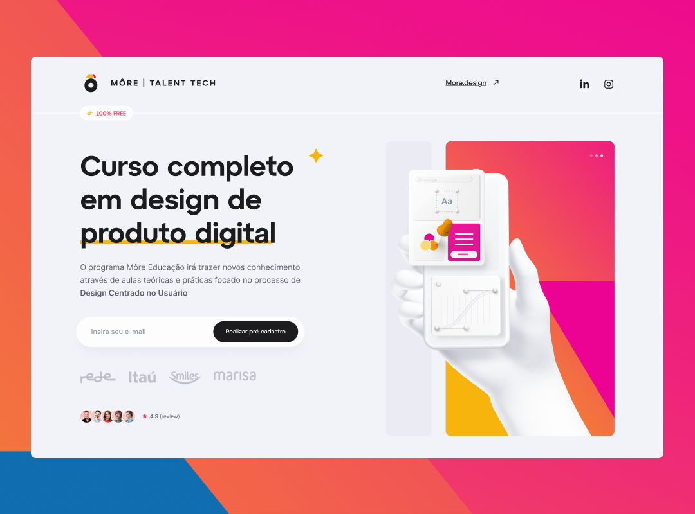

<h1 align="center">
  More Talent Tech
</h1>

  

## 💻 Projeto

Este é o meu primeiro projeto com o SASS depois de estudar a sua sintaxe, fundamentos... Durante esse estudo pude colocar em prática a produtividade que esse pré-processador oferece. A landing page foi desenvolvida apartir desse layout no [Figma](https://www.figma.com/file/e4X90ZQepDwx0OgBIe6bfP/More-Educacao---Codeboost?type=design&node-id=157-135&mode=design&t=MlilxMdYYLlhiZBB-0) no canal do [William Moreira](https://www.youtube.com/@codeboostDev).
Confira o projeto: [Deploy](https://qustavoleite.github.io/more-talent-tech/)

## 🚀 Tecnologias

- HTML
- CSS
- SCSS
- Figma
- [Google Fonts](https://fonts.google.com/)
- [AOS](https://michalsnik.github.io/aos/)

## 📔 Conhecimentos abordados

- [x] Semântica e boas práticas
- [x] Organização de projeto
- [x] Pré-processador Sass

 

> Status do projeto: em breve, atualizações ⏳